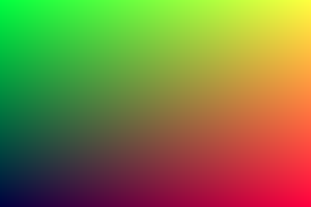
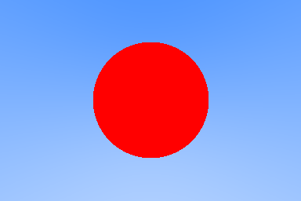

# RayTracingInOneWeekend

An implementation of the book [Ray Tracing in One Weekend](https://raytracing.github.io/books/RayTracingInOneWeekend.html).  

## Table of Contents

- [Programs](#programs)
  * [0. Output an Image](#0-output-an-image)
  * [1. Rays, a Simple Camera, and Background](#1-rays-a-simple-camera-and-background)
  * [2. Adding a Sphere](#2-adding-a-sphere)
- [Library](#library)
- [Building](#building)
- [Build Status](#build-status)

## Programs

### 0. Output an Image



[Source code](./src/0_outputAnImage/main.cpp)

[Link to Chapter 2](https://raytracing.github.io/books/RayTracingInOneWeekend.html#outputanimage)

### 1. Rays, a Simple Camera, and Background


[Source code](./src/1_raysCameraAndBackground/main.cpp)

[Link to Chapter 4](https://raytracing.github.io/books/RayTracingInOneWeekend.html#rays,asimplecamera,andbackground)

### 2. Adding a Sphere



[Source code](./src/2_addingASphere/main.cpp)

[Link to Chapter 5](https://raytracing.github.io/books/RayTracingInOneWeekend.html#addingasphere)

## Library

Common functions and classes are refactored into the [raytrace library](./src/raytrace) and the [GraphicsMath](https://github.com/moddyz/GraphicsMath) project.

## Documentation

Doxygen documentation based on the latest state of master, [hosted by GitHub Pages](https://moddyz.github.io/RayTracingInOneWeekend/).

## Building

A convenience build script is also provided, for building all targets, and optionally installing to a location:
```
./build.sh <OPTIONAL_INSTALL_LOCATION>
```

### Requirements

- `>= CMake-3.17`
- `C++17`

## Build Status

|       | master | 
| ----- | ------ | 
| macOS-10.14 | [](https://travis-ci.com/moddyz/RayTracingInOneWeekend) |
