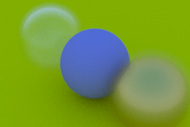
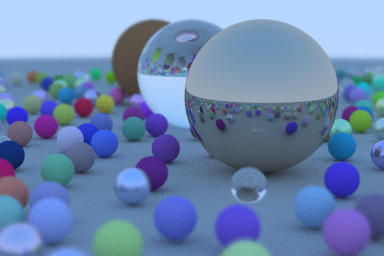

# RayTracingInOneWeekend

An implementation of the book [Ray Tracing in One Weekend](https://raytracing.github.io/books/RayTracingInOneWeekend.html).  

## Table of Contents

- [Programs](#programs)
  * [0. Output an Image](#0-output-an-image)
  * [1. Rays, a Simple Camera, and Background](#1-rays-a-simple-camera-and-background)
  * [2. Adding a Sphere](#2-adding-a-sphere)
  * [3. Surface Normals and Multiple Objects](#3-surface-normals-and-multiple-objects)
  * [4. Antialiasing](#4-antialiasing)
  * [5. Diffuse materials](#5-diffuse-materials)
  * [6. Metal](#6-metal)
  * [7. Dielectrics](#7-dielectrics)
  * [8. Positionable Camera](#8-positionable-camera)
  * [9. Defocus Blur](#9-defocus-blur)
  * [10. Where Next?](#10-where-next)
- [Sequel](#sequel)
- [Library](#library)
- [Building](#building)
- [Build Status](#build-status)

## Programs

### 0. Output an Image


Getting started with writing a colored gradient into an in-memory image buffer, then saving 
as a file encoded using the [PPM image format](https://en.wikipedia.org/wiki/Netpbm#PPM_example).

The [ImageBuffer](https://moddyz.github.io/RayTracingInOneWeekend/classImageBuffer.html) class and utility function [WritePPMIMage](https://moddyz.github.io/RayTracingInOneWeekend/ppmImageWriter_8h.html#a13c10c95d78b09e978f74f8688543f34) are introduced to abstract in-memory pixel storage and serialization details.

[Source code](./src/0_outputAnImage/main.cpp)

[Link to Chapter 2](https://raytracing.github.io/books/RayTracingInOneWeekend.html#outputanimage)

### 1. Rays, a Simple Camera, and Background


Setting up a basic camera model to cast the first rays into the scene.  A single ray is cast per image pixel.  There are no objects in the scene, so the background color are used to shade each pixel, varying based on the associated ray's direction.

[Source code](./src/1_raysCameraAndBackground/main.cpp)

[Link to Chapter 4](https://raytracing.github.io/books/RayTracingInOneWeekend.html#rays,asimplecamera,andbackground)

### 2. Adding a Sphere


Adding a single object into the scene, in the form of a sphere.  Any rays which intersect with the sphere
will provide a bright red color back to its associated pixel.  Otherwise, it will produce the background color.

[Source code](./src/2_addingASphere/main.cpp)

[Link to Chapter 5](https://raytracing.github.io/books/RayTracingInOneWeekend.html#addingasphere)

### 3. Surface Normals and Multiple Objects


Adding in support for object intersections to compute a color based on the intersection point's surface normal.  Also - adding support for multiple scene objects.  The green ground plane behind the center sphere is in fact another large sphere, whose green shade happens to be associated with the surface normal near the top of the sphere!

[Source code](./src/3_surfaceNormalsAndMultipleObjects/main.cpp)

[Link to Chapter 6](https://raytracing.github.io/books/RayTracingInOneWeekend.html#surfacenormalsandmultipleobjects)

### 4. Antialiasing


Adding multi-sampling to produce an averaged color per pixel.  Multi-sampling is achieved by casting _multiple_ rays per-pixel, with a random factor applied to the ray direction.  A color value is accumulated by multiple rays, then averaged before pixel finalization.

[Source code](./src/4_antialiasing/main.cpp)

[Link to Chapter 7](https://raytracing.github.io/books/RayTracingInOneWeekend.html#antialiasing)

### 5. Diffuse materials


[Source code](./src/5_diffuseMaterials/main.cpp)

[Link to Chapter 8](https://raytracing.github.io/books/RayTracingInOneWeekend.html#diffusematerials)

### 6. Metal


[Source code](./src/6_metal/main.cpp)

[Link to Chapter 9](https://raytracing.github.io/books/RayTracingInOneWeekend.html#metal)

### 7. Dielectrics


[Source code](./src/7_dielectrics/main.cpp)

[Link to Chapter 10](https://raytracing.github.io/books/RayTracingInOneWeekend.html#dielectrics)

### 8. Positionable Camera


[Source code](./src/8_positionableCamera/main.cpp)

[Link to Chapter 11](https://raytracing.github.io/books/RayTracingInOneWeekend.html#positionablecamera)

### 9. Defocus Blur



[Source code](./src/9_defocusBlur/main.cpp)

[Link to Chapter 12](https://raytracing.github.io/books/RayTracingInOneWeekend.html#defocusblur)

### 10. Where Next?



[Source code](./src/10_whereNext/main.cpp)

[Link to Chapter 13](https://raytracing.github.io/books/RayTracingInOneWeekend.html#wherenext?)

## Sequel

The sequel, [Ray Tracing: The Next Week](https://raytracing.github.io/books/RayTracingTheNextWeek.html),
is implemented under [RayTracingTheNextWeek](https://github.com/moddyz/RayTracingTheNextWeek).

## Library

Common functions and classes are refactored into the [raytrace library](./src/raytrace) and the [GraphicsMath](https://github.com/moddyz/GraphicsMath) project.

## Documentation

Doxygen documentation based on the latest state of master, [hosted by GitHub Pages](https://moddyz.github.io/RayTracingInOneWeekend/).

## Building

A convenience build script is provided, for building all targets, and optionally installing to a location:
```
./build.sh <OPTIONAL_INSTALL_LOCATION>
```

### Requirements

- `>= CMake-3.17`
- `C++17`
- `doxygen` and `graphviz` (optional for documentation)

## Build Status

|       | master | 
| ----- | ------ | 
| macOS-10.14 | [](https://travis-ci.com/moddyz/RayTracingInOneWeekend) |
