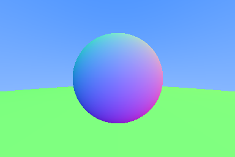
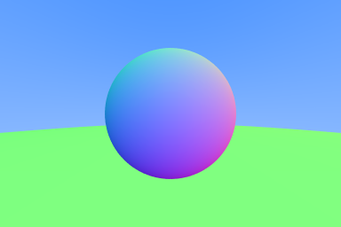
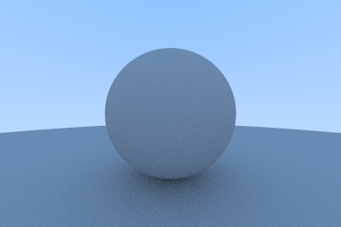
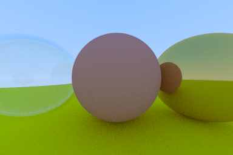
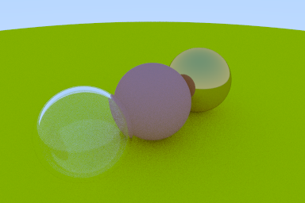

# RayTracingInOneWeekend

An implementation of the book [Ray Tracing in One Weekend](https://raytracing.github.io/books/RayTracingInOneWeekend.html).  

## Table of Contents

- [Programs](#programs)
  * [0. Output an Image](#0-output-an-image)
  * [1. Rays, a Simple Camera, and Background](#1-rays-a-simple-camera-and-background)
  * [2. Adding a Sphere](#2-adding-a-sphere)
  * [3. Surface Normals and Multiple Objects](#3-surface-normals-and-multiple-objects)
  * [4. Antialiasing](#4-antialiasing)
  * [5. Diffuse materials](#5-diffuse-materials)
  * [6. Metal](#6-metal)
  * [7. Dielectrics](#7-dielectrics)
  * [8. Positionable Camera](#8-positionable-camera)
- [Library](#library)
- [Building](#building)
- [Build Status](#build-status)

## Programs

### 0. Output an Image


[Source code](./src/0_outputAnImage/main.cpp)

[Link to Chapter 2](https://raytracing.github.io/books/RayTracingInOneWeekend.html#outputanimage)

### 1. Rays, a Simple Camera, and Background


[Source code](./src/1_raysCameraAndBackground/main.cpp)

[Link to Chapter 4](https://raytracing.github.io/books/RayTracingInOneWeekend.html#rays,asimplecamera,andbackground)

### 2. Adding a Sphere


[Source code](./src/2_addingASphere/main.cpp)

[Link to Chapter 5](https://raytracing.github.io/books/RayTracingInOneWeekend.html#addingasphere)

### 3. Surface Normals and Multiple Objects



[Source code](./src/3_surfaceNormalsAndMultipleObjects/main.cpp)

[Link to Chapter 6](https://raytracing.github.io/books/RayTracingInOneWeekend.html#surfacenormalsandmultipleobjects)

### 4. Antialiasing



[Source code](./src/4_antialiasing/main.cpp)

[Link to Chapter 7](https://raytracing.github.io/books/RayTracingInOneWeekend.html#antialiasing)

### 5. Diffuse materials



[Source code](./src/5_diffuseMaterials/main.cpp)

[Link to Chapter 8](https://raytracing.github.io/books/RayTracingInOneWeekend.html#diffusematerials)

### 6. Metal


[Source code](./src/6_metal/main.cpp)

[Link to Chapter 9](https://raytracing.github.io/books/RayTracingInOneWeekend.html#metal)

### 7. Dielectrics



[Source code](./src/7_dielectrics/main.cpp)

[Link to Chapter 10](https://raytracing.github.io/books/RayTracingInOneWeekend.html#dielectrics)

### 8. Positionable Camera



[Source code](./src/8_positionableCamera/main.cpp)

[Link to Chapter 11](https://raytracing.github.io/books/RayTracingInOneWeekend.html#positionablecamera)

## Library

Common functions and classes are refactored into the [raytrace library](./src/raytrace) and the [GraphicsMath](https://github.com/moddyz/GraphicsMath) project.

## Documentation

Doxygen documentation based on the latest state of master, [hosted by GitHub Pages](https://moddyz.github.io/RayTracingInOneWeekend/).

## Building

A convenience build script is provided, for building all targets, and optionally installing to a location:
```
./build.sh <OPTIONAL_INSTALL_LOCATION>
```

### Requirements

- `>= CMake-3.17`
- `C++17`
- `doxygen` and `graphviz` (optional for documentation)

## Build Status

|       | master | 
| ----- | ------ | 
| macOS-10.14 | [](https://travis-ci.com/moddyz/RayTracingInOneWeekend) |
